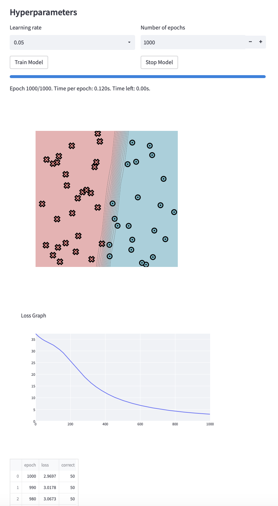
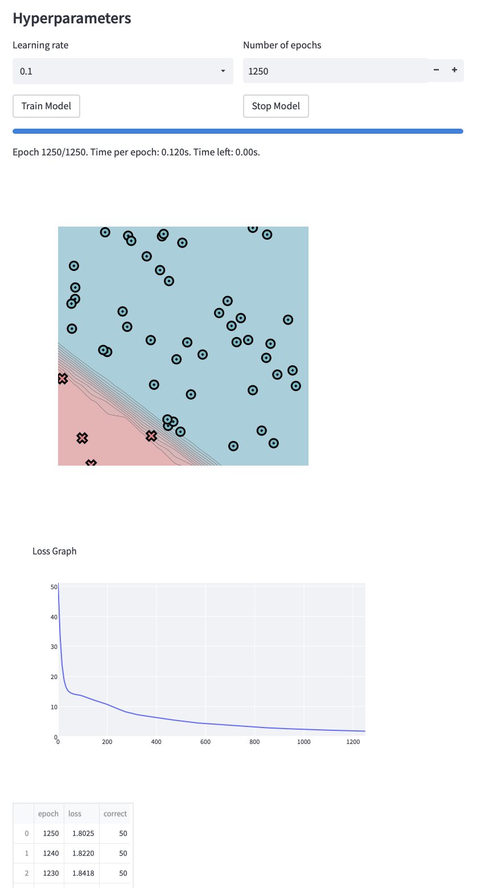
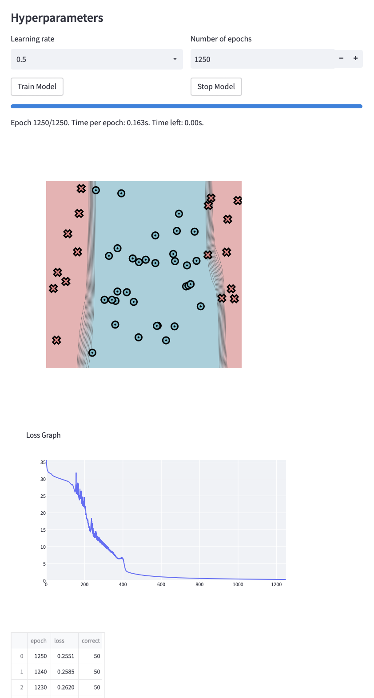
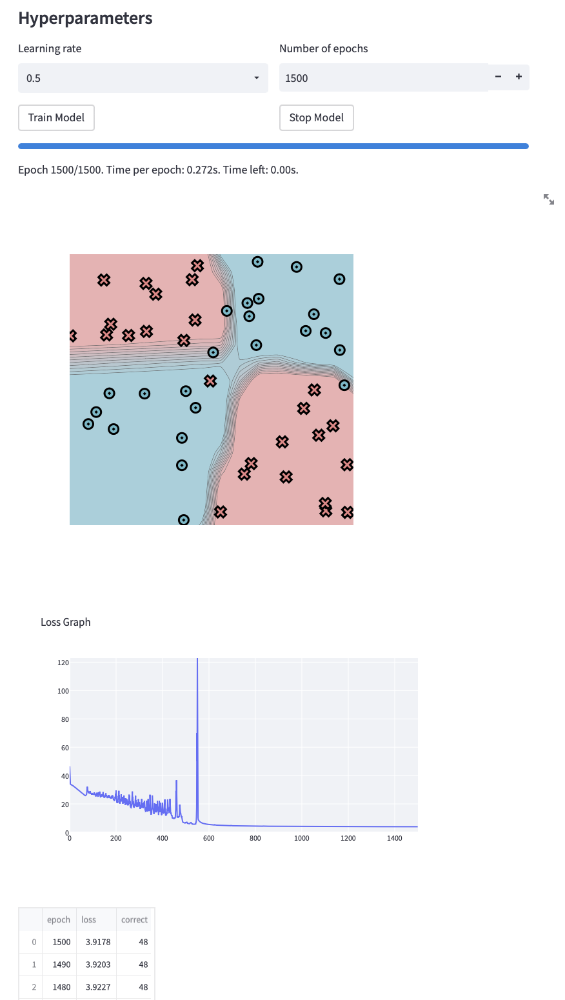
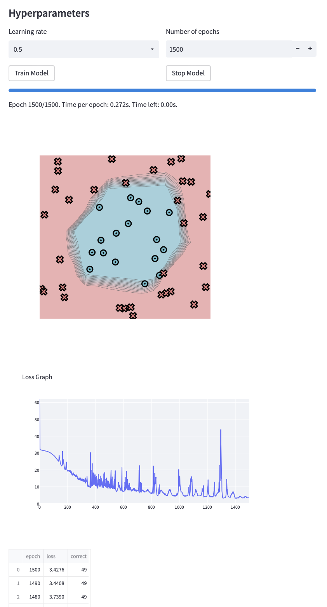
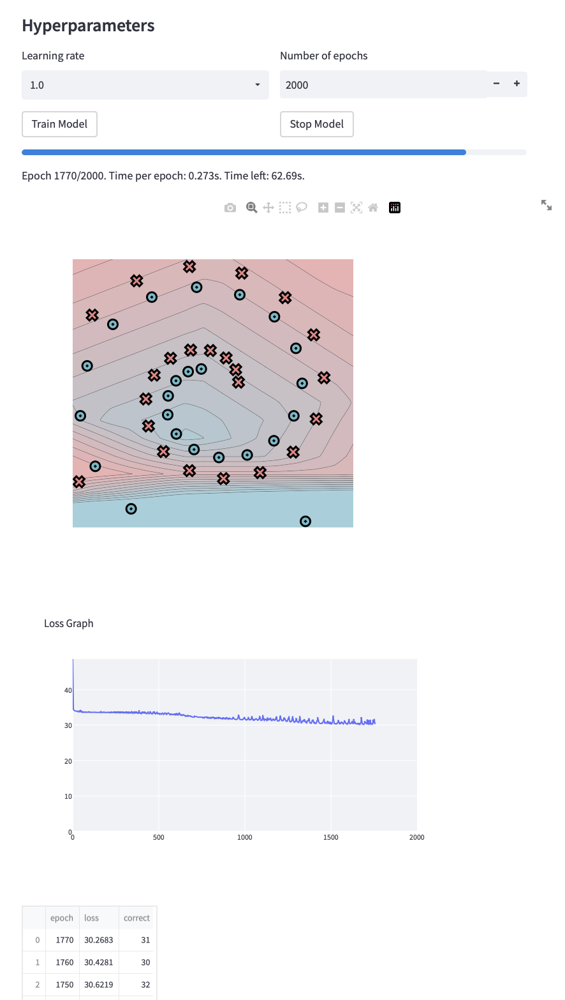

[](https://classroom.github.com/a/YFgwt0yY)
# MiniTorch Module 2


* Docs: https://minitorch.github.io/

* Overview: https://minitorch.github.io/module2/module2/

This assignment requires the following files from the previous assignments. You can get these by running

```bash
python sync_previous_module.py previous-module-dir current-module-dir
```

The files that will be synced are:

        minitorch/operators.py minitorch/module.py minitorch/autodiff.py minitorch/scalar.py minitorch/scalar_functions.py minitorch/module.py project/run_manual.py project/run_scalar.py project/datasets.py

----

The results of training a tensor model on each of the datasets are presented below for `N = 50` points with parameters varying as presented in the image (except for the hidden layer size, given by `h` beforehand).

The times per epoch are as given in the photos a lie in the range [0.120s, 0.272s]

<b>Simple</b>

`h = 3`



<b>Diag</b>

`h = 3`




<b>Split</b>

`h = 4`




<b>Xor</b>

`h = 6`




<b>Circle</b>

`h = 6`




<b>Spiral</b>

Note: Despite trying various combinations of every hyperparameter, I was unable to yield a discernibly better output for this dataset.

`h = 6`



